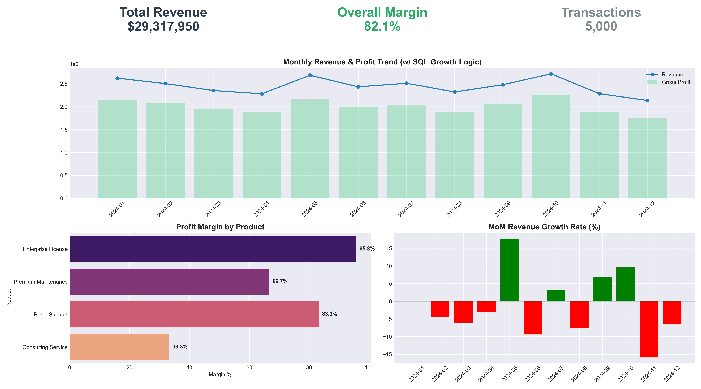

# 📈 Automated Sales Reporting & BI Pipeline


## 📋 Project Overview
This project demonstrates a robust **Business Intelligence (BI) Pipeline** designed to automate monthly financial reporting. It replaces manual spreadsheet work with a scalable Python/SQL architecture.

**Key Goals:**
1.  **Ingest & Clean** raw transaction logs (handling missing regional data).
2.  **Calculate Complex KPIs** (MoM Growth, Margins) using **Advanced SQL**.
3.  **Visualize** results in an executive-style dashboard.

## 📊 Executive Dashboard
*Generated automatically by the pipeline:*



## 🛠 Technical Implementation

### 1. Data Engineering (ETL)
* **Synthetic Data Generator:** A custom script (`generate_data.py`) creates realistic transaction logs (5,000+ rows) with intentional "dirty" data to simulate real-world cleaning scenarios.
* **Cleaning:** Automated imputation of missing values in the ETL process.

### 2. Advanced SQL Logic (Window Functions)
I utilized SQL **Window Functions** (`LAG`, `OVER`) to calculate time-series metrics directly in the database layer.

**Example: Month-over-Month (MoM) Revenue Growth**
```sql
SELECT 
    Month_ID,
    Revenue,
    -- Compare current month to previous month using LAG()
    LAG(Revenue, 1) OVER (ORDER BY Month_ID) as Prev_Month_Rev,
    -- Calculate Growth %
    ROUND((Revenue - LAG(Revenue, 1) OVER (ORDER BY Month_ID)) / LAG(Revenue, 1) OVER (ORDER BY Month_ID) * 100, 2) as Growth_Pct
FROM MonthlyStats