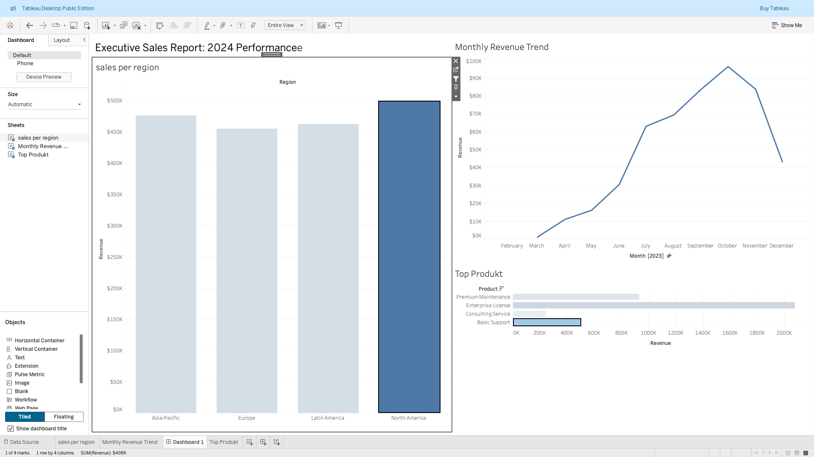

# 📈 Automated Sales Reporting & BI Pipeline


## 📋 Project Overview
This project mimics a real-world **Business Intelligence (BI) Pipeline** designed to automate monthly financial reporting. It replaces manual spreadsheet work with a scalable Python/SQL architecture and a professional Tableau Dashboard.

**Workflow:**
1.  **Python (ETL):** Ingests raw transaction logs and cleans "dirty" data (imputing missing values).
2.  **Advanced SQL:** Calculates complex KPIs like **Month-over-Month Growth** and **Churn Rate** using Window Functions.
3.  **Tableau:** Visualizes the results in an interactive Executive Dashboard with drill-down capabilities.

## 📊 Executive Tableau Dashboard
*Connected directly to the processed data pipeline. Features **Drill-Down** capabilities by Region and Product.*



---

## 🛠 Tech Stack
* **Language:** Python 3.x
* **Data Engineering:** Pandas, NumPy (ETL & Automation)
* **Database:** SQLite (In-Memory Data Warehouse)
* **Visualization:** Tableau Desktop
* **Environment:** Jupyter Notebook

## 📂 Project Structure
```text
Sales-Reporting-Automation/
├── data/                   # Contains generated dataset (raw_sales_data.csv)
├── notebooks/              # Jupyter Notebooks for pipeline logic
│   └── sales_pipeline.ipynb # Main ETL and SQL Churn Logic
├── tableau_dashboard.png   # Screenshot of the final dashboard
├── generate_data.py        # Script to generate synthetic data
├── requirements.txt        # Python dependencies
└── README.md               # Project documentation
```

## 🔍 Key Methodologies
### 1. Data Engineering (Python)
Synthetic Data Generator: A custom script (generate_data.py) creates realistic transaction logs (5,000+ rows) with intentional "dirty" data to simulate real-world cleaning scenarios.

Automation: The pipeline automatically handles missing regional tags (NaN) before analysis.

### 2. SQL Business Logic
I utilized SQL Window Functions (LAG, OVER) to calculate time-series metrics directly in the database layer.
```sql
SELECT 
    Month,
    Revenue,
    -- Compare current month to previous month using LAG()
    LAG(Revenue, 1) OVER (ORDER BY Month) as Prev_Month_Rev,
    -- Calculate Growth %
    ROUND((Revenue - LAG(Revenue, 1) OVER (ORDER BY Month)) / 
           LAG(Revenue, 1) OVER (ORDER BY Month) * 100, 2) as Growth_Pct
FROM MonthlyStats
```
**Feature: Customer Churn Rate Identifying customers active last month who did NOT return this month.**
```sql
SELECT 
    Month,
    Previous_Users,
    Retained_Users,
    -- Churn Rate Formula: (Users Last Month - Retained Users) / Users Last Month
    ROUND(((Previous_Users - Retained_Users) * 1.0 / Previous_Users) * 100, 1) as Churn_Rate_Pct
FROM ChurnStats
```

## 🚀 How to Run
1.  **Clone the repository**
    ```bash
    git clone [https://github.com/adelF-a/sales-reporting-automation.git](https://github.com/adelF-a/sales-reporting-automation.git)
    cd sales-reporting-automation
    ```

2. **Set up the environment**
    ```bash
    python3 -m venv .venv
    source .venv/bin/activate
    pip install -r requirements.txt
    ```


3. **Run the data generator**
   ```bash
   python3 generate_data.py
   ```


4. **Run the pipeline logic**
Open `notebooks/sales_pipeline.ipynb` to execute the SQL logic.


---

## 📬 Contact
**Adel Farfar**
Master Student — Artificial Intelligence | M.Sc. Applied Mathematics
[Email](mailto:adelfarfar@icloud.com)


