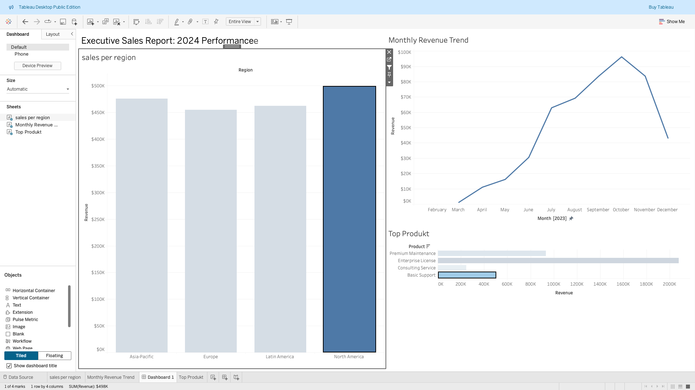

# Automated Sales Reporting with Python and SQL


An end-to-end portfolio project that turns imperfect transaction data into
reproducible financial and customer-retention reports. Python handles data
generation, validation, and visualization; SQLite performs the reporting logic.

## Why this project matters

The important part is not the dashboard alone. The pipeline demonstrates how to:

- generate deterministic synthetic data with a realistic customer lifecycle;
- detect duplicate transactions and invalid commercial values;
- calculate revenue, cost, profit, margin, and month-over-month growth in SQL;
- calculate churn from the **previous month's customer base**;
- verify SQL results against independent Python set arithmetic; and
- regenerate every table and chart with one command.

## Pipeline

```text
Synthetic transactions -> Python validation/ETL -> SQLite reporting layer
                       -> CSV/JSON outputs -> static executive dashboard
```

The raw data deliberately contains missing regions, duplicate transaction IDs,
zero quantities, and negative prices. Cleaning decisions are recorded in
`outputs/validation_report.json` rather than hidden in notebook cells.

## Correct churn definition

For month `t`, the denominator is the customer set from month `t-1`:

```text
churn rate = customers active in t-1 but absent in t / customers active in t-1
```

This distinction matters. Starting from current-month users only would exclude
customers who left and can incorrectly produce zero churn. The implementation is
versioned in [`sql/customer_churn.sql`](sql/customer_churn.sql) and tested against
Python customer sets.

## Dashboard



This is a reproducible static Matplotlib dashboard—not an interactive Tableau
workbook. It is regenerated by the pipeline from the cleaned data.

## Verified example results

Running the pipeline with seed `42` produces:

| KPI | Result |
|---|---:|
| Raw / clean rows | 4,742 / 4,707 |
| Unique customers | 638 |
| Total revenue | 10,954,458.55 |
| Total profit | 7,426,078.55 |
| Profit margin | 67.79% |
| Weighted churn rate | 13.96% |
| Peak revenue month | 2024-01 |
| Highest churn month | 2023-07 |

The validation step identifies 15 duplicate transaction IDs, 120 missing
regions, 10 invalid quantities, and 10 invalid prices. All reported figures are
generated outputs rather than manually entered claims.

## Repository structure

```text
.
├── data/raw_sales_data.csv        # deterministic raw input
├── notebooks/sales_pipeline.ipynb # thin exploratory interface
├── outputs/                       # generated clean data, reports, and dashboard
├── sql/                           # versioned reporting queries
├── tests/test_pipeline.py         # ETL and SQL correctness tests
├── generate_data.py               # synthetic customer-lifecycle generator
├── run_pipeline.py                # one-command production-style entry point
└── requirements.txt
```

## Run locally

```bash
git clone https://github.com/adelF-a/sales-reporting-automation.git
cd sales-reporting-automation
python3 -m venv .venv
source .venv/bin/activate
pip install -r requirements.txt
python run_pipeline.py
python -m unittest discover -s tests -v
```

The pipeline writes:

- `clean_sales.csv`
- `monthly_financials.csv`
- `customer_churn.csv`
- `dimension_summary.csv`
- `validation_report.json`
- `executive_summary.json`
- `executive_dashboard.png`

to the `outputs/` directory.

## Design choices and limitations

- The dataset is synthetic, so results demonstrate engineering and analysis—not
  real commercial performance.
- Missing regions are assigned to `Unknown`; invalid quantities and prices are
  rejected because they cannot support valid sales KPIs.
- SQLite is suitable for this local portfolio example. A production workflow
  would persist data in a warehouse, schedule the pipeline, monitor data quality,
  and publish a governed BI model.

## Contact

**Adel Farfar**<br>
M.Sc. Artificial Intelligence student | M.Sc. Applied Mathematics<br>
[Email](mailto:adelfarfar@icloud.com)
